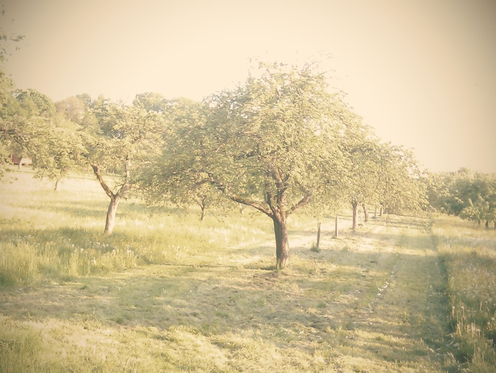

<!--
author:   André Dietrich

email:    LiaScript@web.de

version:  0.0.1

language: de

comment:  Dies ist ein kleiner LiaScript-Kurs über LiaScript.

narrator: Deutsch Male

import: https://raw.githubusercontent.com/liaTemplates/rextester/master/README.md

-->

# LiaScript Basiskurs


## Markdown

### Text allgemein

---

Dies ist ein \_\**wichtiger\** Satz\_.

---

> Dieser Satz ist ^_nicht_^ so wichtig.
>
> _Satz 2_

### Listen & Aufzählungen


2. erster Punkt

   + Dies ist ein \_\**wichtiger\** Satz\_.
   + ein anderer Text

1. __zweiter__ Punkt

* block

  + Dies ist ein \_\**wichtiger\** Satz\_.
  + ein anderer Text

* block

asdfsa

+ block

### Links

Dies ist eine CC-Suche - https://ccsearch.creativecommons.org - Sehr sehenswert.

Named link: __[CC-Suche](https://ccsearch.creativecommons.org "Freie Suchmaschine")__ - Sehr sehenswert.

Interne Links: [Intro](#liascript_basiskurs)

Bilder: <!-- style="width: 100%" -->


#### Multimedia

Audio:

?[Horse](https://www.w3schools.com/html/horse.mp3)

Video:

!?[sound](math.mp4)<!-- style="width: 6cm" -->

!?[youtube](https://www.youtube.com/watch?v=w_CRABsJNKA)

Sonstiges:

??[youtube](https://www.youtube.com/watch?v=w_CRABsJNKA)


## Tabellen

| Header 1 | Header 2 | Header 3 |
|:-------- |:--------:| --------:|
| 1        |  Item 2  |   Item 3 |
| item 2   |  aafdsa  | _asdfsa_ |


| Gruppe  | Gewicht  |    Alter |
|:------- |:--------:| --------:|
| Maus    |   2 kg   |       12 |
| Elefant |   5 kg   | 13 Jahre |
| Mensch  | -12.1 kg |          |
| Fisch   |  2.1 kg  |          |

## Publizieren

https://www.github.com/andre-dietrich/Basics


https://liascript.github.io/course/?https://www.github.com/andre-dietrich/Basics


## Quizze

Was ist 3+3?

[[6]]
[[?]] Es ist kleiner als 7.
[[?]] Es ist größer __als 5__.
**************************

Add a solution explanation __Markdown__!

$$
   \sum_{i=1}^\infty\frac{1}{n^2}
        =\frac{\pi^2}{6}
$$

****************************************

Was ist 3+6?

[[$ f(a,b,c) = (a^2+b^2+c^2)^3 $|
5|9.9e|(<!-- style="height: 40px" -->)]]


[( )] 4
[(X)] 5
[( )] 6
[[?]] Es ist kleiner als 7.
[[?]] Es ist größer __als 5__.
**************************

Add a solution explanation __Markdown__!

$$
   \sum_{i=1}^\infty\frac{1}{n^2}
        =\frac{\pi^2}{6}
$$

****************************************


[[ ]] Add as many elements as you want?
[[X]] The X marks the correct answer!
[[ ]] ... this is wrong ...
[[X]] ... this has to be selected too ...


[[option 1] [option 2] [hhh]]
[[X] [ ] [X]]  add a line
[( ) (X) ( ) ( )]  add a line


## Mathematik

eine Formel $ f(a,b,c) = (a^2+b^2+c^2)^3 $ im Text

$$
   \frac{\overgroup{AB}}{222}
$$


## HTML & Stylen

<h1> _Überschrift_ </h1>

<dl>
   <dt style="color: red">$12 +10 + 2017$</dt>
   <dd>Eröffnung des neuen Palmengartens</dd>
   <dt>20.10.2017</dt>
   <dd>Führung durch den Orchideengarten</dd>
</dl>


Dies ist ein Text der hervorgehoben<!-- style="color: green" --> werden soll!


## Animationen Text2Speech


    --{{1}}--
Zuerst kommt eine _Tabelle_.

    {{1}}
| Header 1   | Header 2   | Header 3   |
| :--------- | :--------- | :--------- |
| Item 1     | {2}{_Item 2_}| Item 3     |

    --{{2 Russian Female}}--
Критская война (греч. Κρητικός Πόλεμος, тур. Girit Savaşi) или Кандийская война
(итал. Guerra di Candia, сербохорв. Kandijski rat) — война в 1645—1669 годах
между Османской империей и Венецианской республикой за остров Крит, на тот
момент крупнейшее и самое богатое заморское владение Венеции.

    {{2}}
``````````````````````````````````````````````````
                             .--->  F
    A       B     C   D     /
    *-------*-----*---*----*----->  E
``````````````````````````````````````````````````

## Programmierumgebung


```cpp
#include <iostream>

int main()
{
    std::cout << "Hello, asdADSworld!\n";
}
```
@Rextester.CPP


``` js     -EvalScript.js
let who = data.first_name + " " + data.last_name;

if(data.online) {
  who + " is online"; }
else {
  who + " is NOT online"; }
```
``` json    +Data.json
{
  "first_name" :  "Sammy",
  "last_name"  :  "Shark",
  "online"     :  true
}
```
<script>
  // insert the JSON dataset into the local variable data
  let data = @input(1);

  // eval the script that uses this dataset
  eval(`@input(0)`);
</script>


## ASCII-Art


``````````````````


       ___     ___      .---+---+---+---+---.     .---+---+---+---.  .---.   .---.
   ___/   \___/   \     |   |   |   |   |   |    / \ / \ / \ / \ /   |   +---+   |
  /   \___/   \___/     +---+---+---+---+---+   +---+---+---+---+    +---+   +---+
  \___/   \___/   \     |   |   |   |   |   |    \ / \ / \ / \ / \   |   +---+   |
  /   \___/   \___/     +---+---+---+---+---+     +---+---+---+---+  +---+   +---+
  \___/   \___/   \     |   |   |   |   |   |    / \ / \ / \ / \ /   |   +---+   |
      \___/   \___/     '---+---+---+---+---'   '---+---+---+---'    '---'   '---'


 +-----------------+      /
 | LiaScript rocks |_____/
 +-----------------+

``````````````````


3.9 |
    |                 ***               (* Sternchen)
  y |               *     *             (r kleine rote Punkte)
  - | r r r r r r r*r r r r*r r r r r r r
  a | r  r R         *         *
  x |            *           *
  i | B B B B B * B B B B B B * B B B B B
  s |         *                 *
    | *  * *                       * *  *
 -100 +------------------------------------
    0              x-axis               1


## Macros
<!--
@hallo
| Header   | Header 2   | Header 3   |
| :--------- | :--------- | :--------- |
| Item @0     | Item 2     | Item 3     |

$ f(a,b,c) = (a^2+b^2+c^2)^3 $

@1

@end
-->

@hallo(Mutti,```(Fee

  ,die Sonne)

```)
